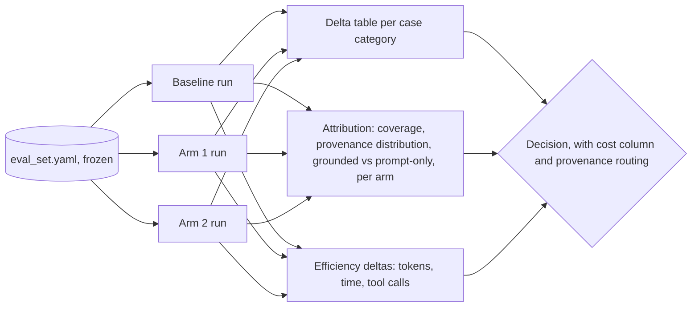

# Arm Comparison and Ablation Matrix

An arm comparison or ablation answers one question: how much does this one component or parameter actually contribute? It is a comparison design, not a new metric. The same frozen eval set runs through two or more pipeline variants that differ in one deliberate change; the plan's existing metric table applies to every variant unchanged, and the result the user acts on is the delta between variants, not any single number.

In an agent pipeline the variants are usually arms: skill on/off, one MCP server added/removed, a CLI tool swapped for an MCP tool, a different model behind the same harness. NVIDIA skillevaluator's baseline-versus-skill lift is the minimal special case of this matrix (two arms, one variable); this file generalizes it.

## When the plan needs an arm matrix, and when it does not

An arm matrix is necessary when the eval exists to make a decision between alternatives:

| The user's situation | Ablate? |
|---|---|
| Choosing between candidate components (skill vs MCP tool vs CLI, model A vs B, two prompt variants) | yes |
| A regression appeared and the causing component is unknown | yes |
| An existing component is expensive and its value is questioned (does the MCP server earn its latency? does the skill earn its tokens?) | yes |
| Deciding whether to add a proposed component before wiring it in | yes |
| Deciding whether an existing tool earns its place on the surface | yes |
| First baseline on a fixed pipeline; no alternatives on the table | no |
| Health check or release gate on one configuration | no |
| Nothing is built yet; the pipeline is a diagram | no; ablating a system that does not run is speculation |

Default to no when the situation is unclear, and say so in one line in the plan. A planner that adds arms nobody asked for turns a cheap eval into a 5x run; that cost is real and lands on the implementer.

## Rules

Each rule exists because skipping it has a specific failure mode:

1. **One variable per arm.** Every arm differs from the baseline in exactly one component or parameter: remove the skill, drop one MCP server, swap one CLI tool. An arm that changes two things at once cannot attribute the delta to either. If the user wants a combined config tested anyway, include it as an explicitly labeled `bundle` arm and mark it excluded from per-component attribution.
2. **The eval set is the control.** Every arm runs against the same `eval_set.yaml`, the same matching rule, the same judge, and the same thresholds. Change any of these between arms and the delta measures the change in the ruler, not the pipeline. The eval set is never regenerated per arm. When an arm changes the harness (for example one arm runs under skillevaluator's Harbor sandbox and another under the user's live agent), either rerun the baseline in the same harness or treat cross-harness deltas as indicative only; harness differences (system prompt, tool surface, sandbox permissions) are themselves a variable.
3. **Baseline first.** The matrix has a baseline row (the current config, defined exactly), and no arm delta is interpreted before baseline numbers exist. The build order must produce the baseline before, or in the same run as, the first arm. When the baseline's traces predate provenance instrumentation (result identity sets were added to the trace after the baseline was committed), the plan adds one freshly traced baseline run with flags unset and traces on, and treats its tallies as extra samples, never as the decision baseline. An arm whose outcome rests on a provenance field the committed baseline never recorded is not interpretable.
4. **Deltas, per segment.** Report every metric as (arm minus baseline), broken down by case `category` (and by `difficulty` where the counts allow), not just in aggregate. An arm that wins the aggregate while losing a segment (a new MCP server that helps task cases but causes negative-control violations) must surface as a flag, not be averaged away; the aggregate is exactly where that failure hides.
5. **A stated difference margin, before running.** For each metric, state the smallest delta that counts as a real difference, in case counts (on a 30-case eval set, a 2-case swing is one or two judgments, not a trend). Deltas inside the margin are reported as "no measurable difference", not ranked. Derive the margin from eval set size and judge noise; for exactly computed metrics (token counts, wall-clock time, pass/fail tallies) the floor is 1 case or 1 unit, and state even that.
6. **Cost and latency in the same table.** Every arm row carries its added latency and per-case cost estimate (tokens and dollars, time in seconds or minutes). An arm matrix exists to serve a tradeoff decision; accuracy deltas without their cost column do not answer the user's actual question, which is almost never "which is highest" and usually "which is worth it". Token and time are first-class metric rows (references/efficiency-eval.md), and their deltas are reported in the same table as completion deltas, not in an appendix.
7. **Rounds, not a sweep.** Cap the matrix at 3 to 5 arms per round, baseline included. The next round is chosen from the previous round's results: keep what won, perturb around it. A full factorial sweep of every combination is almost never the right spend; do not emit one unless the user explicitly asks for it.
8. **Provenance rides along on every arm.** The attribution metrics (attribution coverage, provenance distribution, grounded vs prompt-only split) are part of the identical metric set and are reported next to every delta table (references/provenance-eval.md). They are what routes a delta to a component: a behavioral improvement whose provenance is prompt-only (the model simply answered differently) cannot be caused by the added tool (the evidence was never retrieved), so it is churn, not effect; a delta on grounded mass is the arm's real signal. A keep/cut decision that cites a delta without stating the moved cases' provenance split has not earned its conclusion.

## Spec decisions the plan must pin down

Each is a concrete rule; copy it into the plan as stated, adapted only where the rule itself names a system-specific bit. An implementer must not have to invent what "changed" means between two runs; an under-specified arm definition gets rebuilt differently per run and the deltas become noise.

1. **Arm definition table.** Per arm: arm id; the exact one change vs baseline (component name, parameter, old value to new value); what is held constant (name the harness, model, tool surface, or "identical to baseline"); expected direction of effect and why; added latency; added cost per case (tokens and dollars). State it per arm.
2. **Baseline definition.** The baseline row pins the full config: harness, model, skill presence (present/absent), enabled MCP servers, CLI tools, temperature or other sampling settings. "Current pipeline" is not a definition; name every component and its value.
3. **Identical metric set.** Every arm runs the plan's full metric table from section 2, attribution and efficiency metrics included (rules 6 and 8). Do not trim metrics per arm to save compute; a metric dropped for one arm is a comparison that can never be made later.
4. **Noise margin per metric.** One number, in cases or units, per metric, derived from the eval set size and judge noise, stated before any run.
5. **Stop rule.** The condition under which arm rounds stop (for example: two consecutive rounds with all deltas inside the noise margin, or the decision the matrix serves is made). An arm matrix without a stop rule expands to fill the budget.

## Arm matrix section format

When arm comparison applies, `eval_plan.md` gains this section after Build order:

```
## 5. Arm matrix

Decision this matrix serves: <the user's actual decision, one line>

| Arm | Change vs baseline | Held constant | Expected effect (and why) | Added tokens/case | Added cost/case | Added time/case |
|---|---|---|---|---|---|---|
| baseline | none; production config | - | - | - | - | - |
| arm1 | <exact change> | identical to baseline except <named component> | <direction + reason> | <estimate> | <estimate> | <estimate> |

Baseline config: <full component list with values>
Noise margins: <metric>: <n> cases; <metric>: <n> units
Attribution: provenance capture and join rule identical in every arm; per-arm provenance distribution and grounded vs prompt-only split reported with the delta table (references/provenance-eval.md)
Run order: baseline first, then <order with one-line reason>
Executor: <which arms run via skillevaluator, which run in the user's harness, with the reason>
Stop rule: <condition>
```

## Measurement flow



Cadence: arm rounds run while the decision they serve is live (a choice pending, a regression unattributed), not on every pipeline change. Release-gate evals run on the baseline config alone; re-enter the matrix only when a new decision appears.