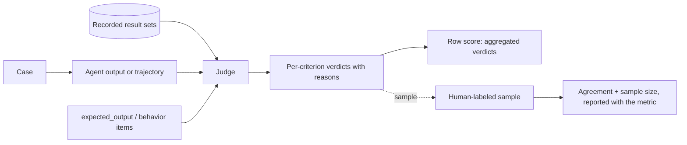

# Judge Discipline

This file is not a stage. It governs every judge the plan uses, at every measurement point, in the baseline and in every arm. A judge grades what a formula or trace scan cannot: answer correctness, behavior adherence, recovery quality. A judge is itself a probabilistic system with known failure modes; an uncalibrated one produces confident noise, and every judge-graded metric inherits that noise while looking exact.

## The deterministic-first rule

Copy into the plan. Metric rows are graded in this order; a judge is reached only when the row cannot be graded any other way, and the row says in one line why.

1. **Trace scan.** The pass condition reduces to events in the trace: a call with named arguments, a recorded result id set, a must-not firing, a forbidden action. Code grades these. Adding a judge here buys noise, not signal.
2. **Formula.** Counts, rates, token sums, wall-clock, deltas. Code grades these.
3. **Judge.** The condition is substantive: "the answer is consistent with the recorded results", "this behavior item is satisfied in substance". Only these rows get a judge.

## Judge design steps

The plan must specify each judge well enough that implementation is mechanical. Five decisions, in order:

1. **Rubric: binary per criterion.** YES/NO per `expected_behavior` item, YES/NO per claim for grounding. Aggregate the verdicts into the row's score afterward. Never a holistic 1-to-10: absolute scales drift and cannot be calibrated; per-criterion verdicts can be audited and re-aggregated.
2. **Reason before verdict.** The judge checks each criterion against the evidence first, then emits `{item, verdict, reason}`. A bare score cannot be audited and drifts; the forced justification is the single largest reliability gain.
3. **Judge inputs.** Task, `expected_output` or the `expected_behavior` items, the final answer or trajectory, and the recorded result sets (ids plus text) from the relevant measurement point, never a re-fetch (provenance-eval.md spec decision 4). Give the judge the `expected_output` for correctness judgments only, never for grounding judgments; the gold answer contaminates grounding.
4. **Judge identity.** A model from a different family than the agent's model where the provider landscape allows (self-preference), named with temperature and prompt version.
5. **Pairwise mode for arm deltas.** When the row feeds an arm comparison, judge arm A vs arm B output on the same case instead of two independent absolute scores; relative judgment is more stable than absolute. Run both orderings; a verdict that flips across orderings counts as "no measurable difference" (ablation.md rule 5 margin), not a win for either arm.

## What goes wrong without this

| Failure | Symptom in results |
|---|---|
| Self-preference | the judge's own model family always wins the arm comparison |
| Verbosity bias | the longer answer wins regardless of grounding; the arm that rambles wins |
| Position bias | pairwise verdicts flip when the ordering flips; deltas sit inside the noise margin |
| Leniency drift | scores creep up across weeks; thresholds calibrated in week 1 stop catching regressions |
| Narration grading | the judge credits "I ran the tool" claims; it grades plausibility, not grounding |
| Unvalidated judge | judge-graded metrics look exact; nobody knows the judge agrees with humans 60% of the time |

## Validation protocol (the step everyone skips)

Copy into the plan when any metric row is judge-graded:

1. Draw the sample once: 10 to 20 cases, kept with the eval set.
2. A human grades the sample against the same rubric the judge uses.
3. Report agreement (percent agreement or Cohen's kappa) with the sample size, next to every judge-graded metric. A judge-graded number without its agreement and sample size overstates what it knows, the same discipline as attribution coverage in provenance-eval.md.
4. Below the minimum agreement the plan sets, judge-graded metrics are reported as unvalidated, and no threshold in section 4 rests on them.
5. Re-validate when the judge model, prompt, or rubric version changes; any of these is a new judge, and a new judge is a ruler change (ablation.md rule 2).

## Spec decisions the plan must pin down

Each is a concrete rule; copy it into the plan as stated, adapted only where the rule names a system-specific bit. An implementer must not have to invent a judge; an under-specified judge gets rebuilt differently per run and every judge-graded delta becomes noise.

1. **Judge identity.** Model, temperature, prompt version, per judge. Family differs from the agent's model where possible, with the reason.
2. **Mode per metric.** Per-criterion binary, or pairwise where the row feeds an arm delta. Carry the mitigations: both orderings for pairwise; plain-text normalized inputs where format is not the metric (format bias); note the length delta when compared outputs differ widely (verbosity bias).
3. **Validation parameters.** Sample size, who labels, agreement metric, minimum agreement, and what happens below it, all set before the first judge-graded run.
4. **Judge prompts are versioned artifacts.** Stored next to `eval_set.yaml`, versioned like it. A rubric or prompt change re-anchors every comparison made across it.

## Plan format impact

The metric table gains no column; judge-graded rows already carry their computation. Section 3 (thresholds) gains one property: every judge-graded metric reports its validation agreement and sample size next to its threshold, and its noise margin is stated in case counts, because a 2-case swing on a 30-case set is one or two judgments.

## Measurement flow

Cadence: judgments run per eval run. Validation runs once per judge version, and again whenever model, prompt, or rubric changes.
