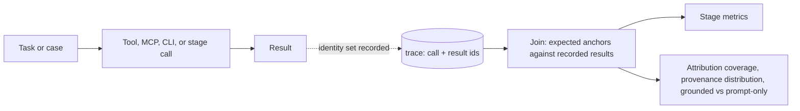

# Provenance and Result Capture

This file is not a stage. It holds two invariants that apply to every eval this skill plans, at every measurement point, in the baseline and in every arm and ablation variant. They exist because a real eval hit the failure: an agent resolver trace recorded every tool call (name and arguments) but never a tool result, so when the follow-up study tried to attribute each resolved edge and each false positive to the tool whose result grounded it, 24 of 84 resolved edges and, before a later join fix, 15 of 51 false positives had no attributable tool. The ablation plan had to stop and add the missing instrumentation before it could answer its own question. Skipping these invariants schedules the same stop for a later date, when it costs a re-run instead of a field.

## Invariant 1: record results, not just calls

Any measurement point that captures a tool, MCP server, CLI, or stage call captures the call AND the result: at minimum the result identity set, the ids of what came back. A call recorded with only its name and arguments is metadata, not evidence.

- Per call, record: tool or stage name, arguments (verbatim or a stable hash), and the result identity set, deduplicated and sorted. Identity examples: the file paths per Read or list result, the issue or PR ids per MCP query result, the stdout line ids or record keys per CLI output, the chunk ids per retrieved chunk, the citation ids per generated citation. Full result text is optional (trace size decides); identity is mandatory.
- Empty result sets are recorded as empty. A skipped empty result is indistinguishable from an unrecorded call, and "no calls were made" and "calls were made but returned nothing" are different findings.
- Record identity at the measurement point where the result enters the pipeline. Reconstructing identities offline from prompt text or arguments is a fallback with lower fidelity (argument-based joins miss every file the agent never named in an argument); the plan states it is a fallback, never the primary capture.
- Agent-skill traces follow the same rule: a skill file read records which sections were loaded, not just that the file was opened.

Failure mode when skipped: the trace shows what was asked, never what was answered. Every downstream attribution becomes an argument-based guess, and the unattributable residue surfaces late as an "N of M unaccounted" row in a plan that must then pause to instrument before any arm runs.

## Invariant 2: provenance is a must for every metric

Every metric row in the plan's metric table names the provenance field it consumes: the trace field recording which call's result supplied the evidence behind the number. A metric with no provenance field is marked `provenance-exempt` with a one-line reason.

- Quality metrics on matches, answers, citations, triggering, or behavior checks are never exempt: each rests on some recorded result, and naming it is what makes the metric attributable when it moves.
- Cost, latency, token, and count-only metrics are legitimately exempt; say so in the row rather than leaving the cell empty.
- A metric whose provenance field does not yet exist in the user's trace is a build-order row: instrument the capture first (invariant 1), then the metric goes live. The plan states which comes first instead of shipping a metric that silently runs unattributed.

## What provenance buys (metrics that consume it)

| Metric | Computation | Question it answers |
|---|---|---|
| Attribution coverage | attributable cases or edges / total | how much of the run can be attributed at all; reported next to every provenance distribution, because a distribution without its coverage overstates what it knows |
| Provenance distribution | matched behaviors (or resolved edges) counted by the tool or stage whose recorded result supplied the anchor | which tool earned the matched mass; the quantitative version of "search-first" style claims |
| Grounded vs prompt-only split | matches and false positives split by whether any recorded result contains the anchor | which mass a tool ablation can move (grounded) and which only prompt or instruction changes can move (prompt-only) |
| Call-result yield | of calls whose recorded results contain an expected anchor, the share where the match or answer actually used that result | bounds the over-credit of tolerant joins: a tool whose result covered the anchor but was ignored still gets credit unless the yield is checked |

The false-positive split is the one ablation readers need most: a spurious tool call with prompt-only provenance stays put under any tool-only arm (it was instructed, not attracted by a result); a spurious call with tool provenance is the arm's real target. Reporting the split next to spurious-call counts is what turns "spurious calls delta = 2" into a finding about the tool rather than churn.

## Spec decisions the plan must pin down

Each is a concrete rule; copy it into the plan as stated, adapted only where the rule names a system-specific bit. An implementer must not have to invent what a "recorded result" is; an under-specified capture rule gets rebuilt per run and every provenance join becomes noise.

1. **Result identity extraction rule, per tool.** For every tool, MCP server, or CLI on the measured path, name exactly which field of its result is the identity (for example: a file-list tool returns entries, each entry's `path` field; an MCP search tool returns hits, each hit's `id`; a CLI command returns stdout, the record key per line). State it per tool; do not leave the extraction to the implementer.
2. **Join tolerance.** Provenance joins use the same matching tolerance as the eval scorer (exact or prefix-tolerant), stated once. Prefix-tolerant joins credit every tool whose recorded results covered the anchor, including calls the agent ignored; that ceiling is stated in the plan, and strict per-token provenance is noted as out of scope where the tool-call interface does not expose it, rather than silently assumed.
3. **Unaccounted is a reported bucket.** Every provenance distribution reports its unaccounted bucket alongside the attributed ones. Dropping it overstates attribution coverage; a large unaccounted bucket is a finding about capture, and the fix is recording results, not a smarter offline join.
4. **Judge inputs come from recorded results.** Faithfulness, citation, and correctness judges receive the recorded result set (ids plus text) captured at the tool measurement point, not a re-fetch. A citation whose id falls outside the recorded result set is itself a finding, not a valid citation.
5. **One capture rule across arms.** In an arm comparison or ablation, the same extraction rule and the same join tolerance run in every arm, baseline included. A provenance change between arms is a ruler change; its deltas are noise (references/ablation.md rule 2).

## Metric table column

The plan's metric table gains one column, `provenance field`, after the eval-set-field column:

| Metric | ... | Eval set field | Provenance field |
|---|---|---|---|
| Behavior match rate | ... | `expected_behavior` | `tool_calls.result_ids` |
| Answer correctness | ... | `expected_output` | `generation.citation_ids` joined to `tool_calls.result_ids` |
| Cost per case | ... | none | `provenance-exempt`: cost is not evidence-grounded |

## Measurement flow

Cadence: capture is per run, always, baseline included. Attribution analysis runs whenever a metric moves and the causing component is in question, and always alongside an arm-comparison or ablation delta table.