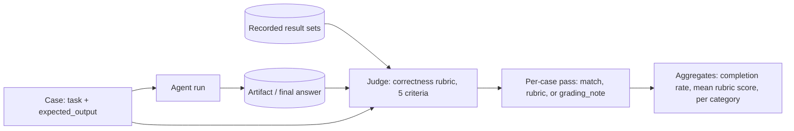

# Task Completion and Answer Eval

This reference covers the metrics that grade the destination: did the task produce the right final artifact or answer. It is the agent-pipeline counterpart of generation-eval: same judging discipline (per-case criteria, grading_notes, judges that see recorded evidence), applied to `expected_output` and completion rather than grounded answers.

## What can go wrong

| Failure | Symptom |
|---|---|
| Right answer, wrong path | Correct totals hand-typed instead of computed by the tool; only implicit cases and grading_notes catch this |
| Fabricated grounding | Answer consistent with an observation the agent invented; passes plausibility checks, fails against recorded results |
| Fast wrong answer | Well-formed output that does not meet the goal; one completion number hides it |
| Partial completion | Multi-part task silently dropped a part; all-or-nothing grading reports a pass |
| Invalid artifact | File produced but does not parse, compile, or open as claimed |
| Completion without quality | Artifact exists and is structurally valid, content is wrong or unusable |

## Stage metrics

| Metric | Computation | Consumes | Provenance field | Threshold is set from |
|---|---|---|---|---|
| Task completion rate | cases where the final artifact matches expected_output / all cases with expected_output | `expected_output` | `generation.final_answer` + recorded results used | the stakes of a missing or wrong artifact for this case category, segmented per category; a bulk summarizer and a reconciliation workflow do not share a pass target |
| Answer correctness | per-case rubric below / cases with expected_output | `expected_output` | recorded result sets | how close to the expected output an answer must be to be useful to this user, per category (a paraphrased fact vs a synthesized reconciliation); judged against recorded results, so it is only as trustworthy as the judge validation |
| Goal achievement | did the run end with the user's goal met (not just a well-formed answer) | task + `expected_output` | full trajectory | what a well-formed non-answer costs the user; usually report-only next to completion, threshold when the product is a direct-answer interface |
| Artifact validity | produced files parse/compile/open as claimed | `expected_output` | file-system events | a hard gate: an artifact that does not parse fails the case regardless of everything else; the plan states this rather than a percentage |

The 5-criterion rubric adapted for agent pipelines (borrowed from skillevaluator's accuracy rubric; use when the artifact is prose or a mixed answer rather than a file):

```
Score each criterion against the expected_output. For each, answer YES or NO.
1. TOOL_IDENTIFIED: did the agent use the expected surface (skill/MCP/CLI) where the case expects it?
2. ACTION_CORRECT: are the actions taken the ones the task requires?
3. FACTUALLY_ACCURATE: are the factual claims consistent with the recorded results?
4. TASK_ADDRESSED: does the output directly address the user's request?
5. ACTIONABLE: does the output provide usable information (not just acknowledgment)?
score = count(YES) / 5
Be lenient on exact wording but strict on factual correctness.
```

Caveats:
- Criterion 1 belongs to trajectory-eval when the case is implicit or negative; in those cases grading tool use here double-counts. The plan states which reference owns criterion 1 per category.
- FACTUALLY_ACCURATE is judged against recorded results (ids plus text), not against the agent's own summary of what it saw (provenance-eval.md spec decision 4). An answer consistent with a hallucinated observation is not accurate.
- A case whose `grading_note` redefines passing passes when its note is satisfied, regardless of the rubric score. The note wins; the rubric is the default, not an override.
- The rubric is judge work where the criteria are substantive (criteria 3 to 5) and trace-scan work where they are mechanical (criterion 1); grade each criterion the cheapest way that works, per references/judge-eval.md's deterministic-first rule.

## Per-case pass vs aggregate

- Per-case pass/fail comes from `expected_output` match, the rubric, or the `grading_note`, decided per case, never from an aggregate crossing a threshold.
- Aggregates (completion rate, mean rubric score) are for tracking and arms comparison, not for passing individual cases.
- When a plan runs an M2-only arm (trajectory captured, final answers not graded), completion metrics cannot be computed in that arm; the plan states this so the implementer does not guess.

## Spec decisions the plan must pin down

1. **Artifact match rule.** For file artifacts: exact content, structural match (parses, right schema), or spot-checked fields? State which per artifact type; "correct file" under-specified gets graded three different ways by three implementers.
2. **Answer judge inputs.** The judge for correctness receives: the task, `expected_output`, the final answer, and the recorded result sets. State this in the plan; a judge without the recorded results grades plausibility, not grounding.
3. **Partial credit policy.** Whether multi-part tasks get per-part credit (each part pass/fail, reported separately) or all-or-nothing. Default per-part: a reconciliation that is right except for the flagged row is a different finding from a wrong reconciliation, and the delta between arms lives in the parts.
4. **Completion vs quality split.** Task completion (artifact exists and is structurally valid) and answer quality (rubric) are separate rows with separate thresholds; one number hides arms that ship fast wrong answers.

## Measurement flow



Cadence: per eval run, on every arm. Aggregates are for tracking and arm deltas; per-case pass is always decided per case.

## Threshold guidance

No numbers here on purpose. Set each threshold case-by-case with the user, from the "Threshold is set from" column, and record the reason in the plan. Three properties to account for:

1. Segments: completion and correctness thresholds are set per case category. A single system-wide pass target lets task cases carry contextual ones.
2. Judge noise: judge-based correctness is noisier than trace-scan checks; the noise margin is stated in case counts (references/judge-eval.md plan-format section), and the judge's validation agreement is reported next to the threshold.
3. Per-case pass: cases with a `grading_note` pass when the note is satisfied, regardless of aggregates; the note wins over the rubric, and the rubric wins over nothing else.