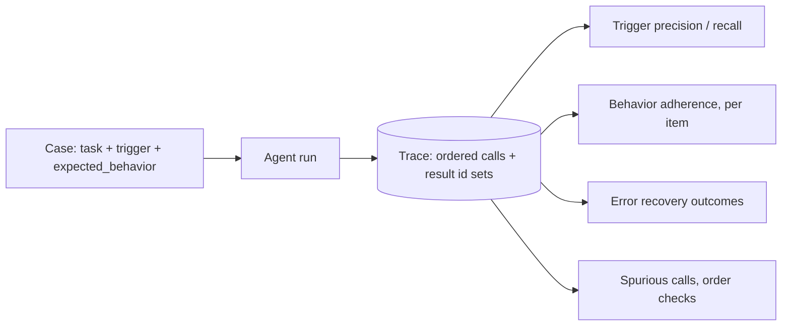

# Trajectory, Triggering, and Behavior Eval

This reference covers the metrics that grade the path the agent took, not the destination: whether the right skill or tool fired, whether the workflow order was sane, whether the agent recovered from errors, and whether it avoided what it should have avoided. These signals live in the trajectory (the ordered record of tool/MCP/CLI calls and results), which is why they depend on provenance-eval.md invariant 1: a trajectory of calls without recorded results cannot support behavior grading, because "the agent read the config" and "the agent asked and was refused" look identical.

## What can go wrong

| Failure | Symptom |
|---|---|
| False-positive trigger | Adjacent-sounding input fires the skill or tool; wasted tokens, possible wrong actions; caught only by negative cases |
| Silent non-use | Agent answers with generic tools where the purpose-built path existed; answer may look fine, the path is wrong |
| Out-of-order execution | Result depends on step order (config read after write); outcome-level passes hide it |
| Fabrication on error | Tool fails, agent invents the value and continues; final answer looks complete |
| Hidden tool use | Agent fired the tool and did not disclose it; grading the final answer alone passes this |
| Wandering | Loops and repeated calls; completion passes, cost explodes (references/efficiency-eval.md makes the cost visible) |

## Stage metrics

| Metric | Computation | Consumes | Provenance field | Threshold is set from |
|---|---|---|---|---|
| Trigger precision | correct non-firing / all must-not cases | `trigger`, `must_not_use` | trace: skill-loads and tool-calls sequences | the cost of a false firing for this surface (wasted tokens, wrong side effects); negative and security cases are cheap to add, so precision is usually held high |
| Trigger recall | correct firing / all must cases | `trigger` | trace: skill-loads and tool-calls sequences | what silent non-use costs the user (a generic-tool answer where the purpose-built path existed); usually the headline threshold for a discovery-focused skill |
| Skill execution order | cases where expected_behavior items appear in the trajectory in order / all must cases | `expected_behavior` | trace: ordered call+result list | whether out-of-order steps produce wrong results in this pipeline, or order is advisory; advisory means report-only |
| Behavior adherence | expected_behavior items individually checked present or absent per case (per-item, not averaged) | `expected_behavior` | trace: ordered call+result list | set per behavior item: which items are load-bearing (a threshold) and which are advisory (report-only); one item-level number hides which item failed |
| Error recovery | recovery outcomes (flagged, retried-successfully, fabricated, aborted) counted per case | case obstacles | trace: error events and subsequent calls | what a fabricated value costs in this domain; when outputs feed decisions, fabricated and hid approach zero tolerance, and any instance fails the run |
| Spurious tool calls | calls not required by any expected_behavior and not serving the task, per case | reviewer judgment | trace: ordered call+result list | the token and dollar cost of a spurious call at the user's volume; report-only unless volume makes the cost real |

Notes:
- Trigger precision and recall are reported as a pair; a single "routing accuracy" number hides which side failed, and the fix differs (precision fails → negative cases; recall fails → discovery or description problems).
- Per-item behavior adherence is deliberately not averaged into one score per case: an agent that does 4 of 5 behavior items is a different finding depending on which item it skipped, and the item names travel in the report.
- Error recovery grading requires the case to actually contain an obstacle (multi-step cases with deliberate failures); a recovery metric over cases with no obstacle measures nothing.

## Judge rubric for behavior checks (when not exactly computable)

When expected_behavior items are not mechanically checkable from the trace (for example "identifies the right capability"), use an LLM judge over the trajectory with per-item YES/NO:

```
For each expected_behavior item, answer YES or NO against the trajectory:
1. Is the behavior observable in the trace (a call, a file, an output)?
2. Did the recorded results (not the agent's narration) support it?
Be lenient on exact wording but strict on sequence and evidence.
Output per item: {item, verdict: YES|NO, reason}.
```

The judge receives the recorded result sets, not just the calls (provenance-eval.md spec decision 4). A judge scoring from narration alone credits agents that talked about the right tool without evidence they used it. Judge design follows references/judge-eval.md: deterministic-first (this rubric exists only because some behavior items are not trace-scan checkable), binary per item, reason before verdict, judge model from a different family than the agent's, validated against a human-labeled sample.

## Spec decisions the plan must pin down

## Spec decisions the plan must pin down

1. **Skill-load definition.** What counts as "the skill fired": the SKILL.md read? a section read? a script run? Name the trace event(s) per harness. Under-skilling (counting a glance at the file) overstates recall; over-skilling misses partial activation.
2. **Tool-call identity.** For each MCP server and CLI tool, how a call appears in the trace (server name + tool name + arguments; CLI binary + argv). State it per surface; normalizing ad hoc makes cross-arm comparisons noise.
3. **Negative-case grading.** Exact events that constitute a violation (any read of the skill dir? any script invocation? any MCP tool call from that server?), per must-not case. Grading from the final answer alone passes agents that fired the tool and then hid it.
4. **Recovery outcome taxonomy.** The fixed set: `flagged` (reported, did not fabricate), `retried-successfully`, `failed-openly`, `fabricated`, `hid`. Fabricated and hid are fail outcomes regardless of the final answer; name which cases each applies to.
5. **Order tolerance.** Whether expected_behavior order is strict or lenient (for example: config read must precede write, but the two report steps may swap). State per case or per behavior item, not globally.

## Measurement flow



Cadence: trigger and behavior checks run per eval run, on every arm. Error recovery runs on the cases that contain an obstacle (multi-step); running it on obstacle-free cases measures nothing.

## Threshold guidance

No numbers here on purpose; set each threshold case-by-case with the user, from the "Threshold is set from" column, and record the reason in the plan. Two properties to account for:

1. Segments: trigger precision and recall are reported as a pair and segmented by case category; a system-wide routing number hides which side failed (precision fails on negative cases, recall on implicit ones), and the fixes differ.
2. Per-case pass: behavior adherence is per item, never averaged into one case score; the plan states which items are load-bearing before the first run, because "4 of 5" is a different finding depending on which item was skipped.