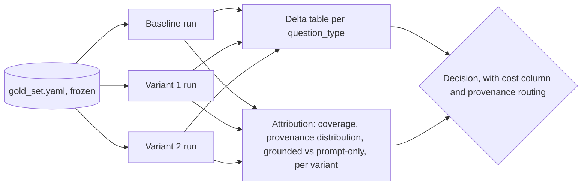

# Ablation Matrix

An ablation answers one question: how much does this one component or parameter actually contribute? It is a comparison design, not a new metric. The same frozen gold set runs through two or more pipeline variants that differ in one deliberate change; the plan's existing metric table applies to every variant unchanged, and the result the user acts on is the delta between variants, not any single number.

## When the plan needs a variant matrix, and when it does not

Ablation is necessary when the eval exists to make a decision between alternatives:

| The user's situation | Ablate? |
|---|---|
| Choosing between candidate designs (reranker vs none, hybrid vs dense, chunk size A vs B) | yes |
| A regression appeared and the causing stage or component is unknown | yes |
| An existing component is expensive and its value is questioned (does the reranker earn its latency?) | yes |
| Deciding whether to add a proposed component before wiring it in | yes |
| Deciding whether an existing tool earns its place on the surface (which tool grounds the outputs, does it still earn its cost when ablated) | yes |
| First baseline on a fixed pipeline; no alternatives on the table | no |
| Health check or release gate on one configuration | no |
| Nothing is built yet; the pipeline is a diagram | no; ablating a system that does not run is speculation |

Default to no when the situation is unclear, and say so in one line in the plan. A planner that adds variants nobody asked for turns a cheap eval into a 5x run; that cost is real and lands on the implementer.

## Rules

Each rule exists because skipping it has a specific failure mode:

1. **One variable per variant.** Every variant differs from the baseline in exactly one component or parameter. A variant that changes two things at once cannot attribute the delta to either. If the user wants a combined config tested anyway, include it as an explicitly labeled `bundle` variant and mark it excluded from per-component attribution.
2. **The gold set is the control.** Every variant runs against the same `gold_set.yaml`, the same chunk-matching rule, the same judge, and the same thresholds. Change any of these between variants and the delta measures the change in the ruler, not the pipeline. The gold set is never regenerated per variant. Variants that change ingestion (chunk size, chunking strategy) require re-ingestion and re-embedding of the corpus and can invalidate chunk-id matching; use section-overlap matching so the ruler stays constant across variants. The provenance capture rule is part of the ruler: the same result-identity extraction and the same join tolerance run in every variant, baseline included (references/provenance-eval.md spec decision 5).
3. **Baseline first.** The matrix has a baseline row (the current config, defined exactly), and no variant delta is interpreted before baseline numbers exist. The build order must produce the baseline before, or in the same run as, the first variant. When the baseline's traces predate the provenance instrumentation (result identity sets were added to the trace after the baseline was committed), the plan adds one freshly traced baseline run with flags unset and traces on, and treats its tallies as extra samples, never as the decision baseline. A variant whose outcome rests on a provenance field the committed baseline never recorded is not interpretable.
4. **Deltas, per segment.** Report every metric as (variant minus baseline), broken down by `question_type`, not just in aggregate. A variant that wins the aggregate while losing a segment (a reranker that helps factual but hurts multi-hop) must surface as a flag, not be averaged away; the aggregate is exactly where that failure hides.
5. **A stated difference margin, before running.** For each metric, state the smallest delta that counts as a real difference, in case counts (on a 40-case gold set, a 2-case swing is one or two judgments, not a trend). Deltas inside the margin are reported as "no measurable difference", not ranked. Derive the margin from gold set size and judge noise; for exactly computed retrieval metrics the floor is 1 case, and state even that.
6. **Cost and latency in the same table.** Every variant row carries its added latency and per-query cost estimate. An ablation exists to serve a tradeoff decision; accuracy deltas without their cost column do not answer the user's actual question, which is almost never "which is highest" and usually "which is worth it".
7. **Rounds, not a sweep.** Cap the matrix at 3 to 5 variants per round, baseline included. The next round is chosen from the previous round's results: keep what won, perturb around it. A full factorial sweep of every combination is almost never the right spend; do not emit one unless the user explicitly asks for it.
8. **Provenance rides along on every variant.** The attribution metrics (attribution coverage, provenance distribution, grounded vs prompt-only split) are part of the identical metric set and are reported next to every delta table. They are what routes a delta to a component: a false-positive delta with prompt-only provenance cannot be caused by the ablated tool (the evidence was instructed, not retrieved), so it is churn, not effect; a delta on grounded mass is the arm's real signal. A keep/cut decision that cites an FP delta without stating the moved FPs' provenance split has not earned its conclusion.

## Spec decisions the plan must pin down

Each is a concrete rule; copy it into the plan as stated, adapted only where the rule itself names a system-specific bit. An implementer must not have to invent what "changed" means between two runs; an under-specified variant definition gets rebuilt differently per run and the deltas become noise.

1. **Variant definition table.** Per variant: variant id; the exact one change vs baseline (component name, parameter, old value to new value); what is held constant (name the stages, or "identical to baseline"); expected direction of effect and why; added latency; added cost per query. State it per variant.
2. **Baseline definition.** The baseline row pins the full config: embedding model, chunk size, retrieval strategy, k, reranker presence, generation model. "Current pipeline" is not a definition; name every component and its value.
3. **Identical metric set.** Every variant runs the plan's full metric table from section 2, attribution metrics included (rule 8). Do not trim metrics per variant to save compute; a metric dropped for one variant is a comparison that can never be made later.
4. **Noise margin per metric.** One number, in cases, per judge-based metric, derived from the gold set size, stated before any run.
5. **Stop rule.** The condition under which variant rounds stop (for example: two consecutive rounds with all deltas inside the noise margin, or the decision the matrix serves is made). Ablation without a stop rule expands to fill the budget.

## Variant matrix section format

When ablation applies, `eval_plan.md` gains this section after Build order:

```
## 5. Variant matrix

Decision this matrix serves: <the user's actual decision, one line>

| Variant | Change vs baseline | Held constant | Expected effect (and why) | Added latency | Added cost/query |
|---|---|---|---|---|---|
| baseline | none; production config | - | - | - | - |
| v1 | <exact change> | identical to baseline except <named stage> | <direction + reason> | <estimate> | <estimate> |

Baseline config: <full component list with values>
Noise margins: <metric>: <n> cases; <metric>: <n> cases
Attribution: provenance capture and join rule identical in every variant; per-variant provenance distribution and grounded vs prompt-only FP split reported with the delta table (references/provenance-eval.md)
Run order: baseline first, then <order with one-line reason>
Stop rule: <condition>
```

## Measurement flow



Cadence: ablation rounds run while the decision they serve is live (a choice pending, a regression unattributed), not on every pipeline change. Release-gate evals run on the baseline config alone; re-enter ablation only when a new decision appears.
