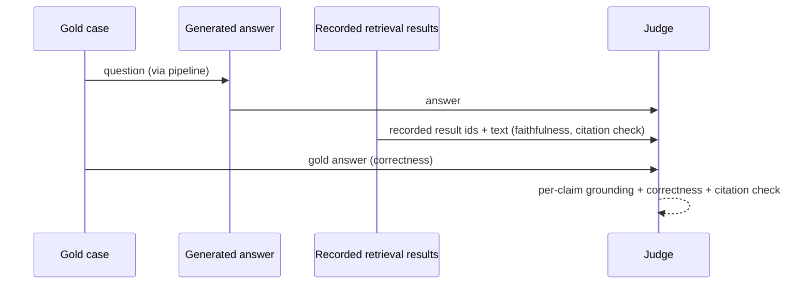

# Generation Eval

Generation evals measure the answer, given that retrieval may or may not have done its job. The central challenge: answers are free text, so most metrics are judge-based. That makes judge design (rubric, scale, examples) the real work here, not metric selection.

## What can go wrong

| Failure | Symptom |
|---|---|
| Hallucination | Answer states facts absent from retrieved chunks |
| Ignored context | Answer correct but not grounded, cannot be traced |
| Unfaithful compression | Answer subtly changes a number, unit, or qualifier |
| Wrong citation | Cited chunk does not contain the supporting claim |
| Missing citation | Claim made with no pointer back to source |

## Metrics

| Metric | Computation | Provenance field | Threshold is set from |
|---|---|---|---|
| Faithfulness / groundedness | Judge: each claim in the answer is supported by retrieved context. Score = supported claims / total claims | `generation.citation_ids` joined to the recorded retrieval result set (references/provenance-eval.md) | domain stakes: how many unfaithful answers users would encounter before trust breaks; usually the strictest threshold in the plan |
| Answer correctness | Judge vs gold `expected_answer`: semantic equivalence, not string match | `retrieval.result_chunk_ids` (the recorded context the answer was generated from) | how close to gold an answer must be to be useful to this user, per case type (a paraphrased fact vs a synthesized multi-hop conclusion) |
| Answer relevance | Judge: does the answer address the question as asked | `provenance-exempt`: judged on question and answer text only | user tolerance for off-target answers; stricter when the product is a direct-answer interface |
| Citation accuracy | cited chunks that actually support their claim / total citations | `generation.citation_ids` joined to the recorded retrieval result set | whether citations are a user-facing trust feature (then strict) or internal plumbing (then report-only) |
| Hallucination rate | cases where the judge finds unsupported material claims | `generation.citation_ids` joined to the recorded retrieval result set | stakes of the domain: in medical, legal, or financial corpora this approaches zero-tolerance, in casual domains it can be a tracked trend |

Faithfulness is the headline metric: a wrong-but-grounded answer is a retrieval bug you can trace, a confident ungrounded answer is a trust-destroyer. Order it first in the plan. That traceability is literal: grounding judgments are made against the recorded retrieval result set (invariant 1 of references/provenance-eval.md), so a hallucination can be traced to the missing chunk id, and citation accuracy is only computable when the generation measurement point recorded which results were passed in. If the generation measurement point does not record the result ids it received, instrument that capture before any M3 metric goes live; a judge given re-fetched context scores a different pipeline than the one that produced the answer.

## Judge design

Since this skill does not execute code, the plan must specify the judge well enough that implementation is mechanical:

1. **Rubric**: a binary or 3-point judgment per claim (supported / partially / unsupported). Binary per-claim scoring is more reliable than holistic 1 to 10 scores; prefer it.
2. **Judge inputs**: question, retrieved chunks, answer, gold answer. The retrieved chunks are the recorded result set captured at the retrieval measurement point, not a re-fetch (references/provenance-eval.md spec decision 4). Never give the judge the gold answer for faithfulness scoring, only for correctness scoring; otherwise it contaminates grounding judgments.
3. **Scale decisions**: recommend 3 judges per case with majority vote only if a single judge proves unstable; start with one, measure disagreement on a 20-case sample first.

## Measurement flow

## Threshold guidance

No static numbers here on purpose: generation thresholds are set case-by-case, in the pipeline session, from the dependency in the table, with the reason recorded in the plan. Two properties they must always account for:

1. Judge noise: judge-based metrics are noisier than retrieval metrics, and a small numeric difference on 40 cases is one or two judgments. The plan must state the margin (in cases, not decimals) that counts as a real regression.
2. Per-case pass criteria: for gold cases carrying a `grading_note` (ambiguous, edge), the case passes when its note is satisfied. Aggregates do not override individual case criteria. Note also that any per-case pass criterion requiring M3 signals (answer correctness, faithfulness) cannot be applied during an M2-only run; an M2-only implementer cannot produce per-case pass/fail from M2 alone.