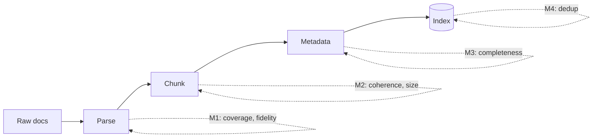

# Ingestion Eval

Ingestion is everything between raw documents and the searchable index: parsing, chunking, embedding, and metadata. Errors here silently poison everything downstream, and unlike retrieval or generation they rarely show up as a bad answer, they show up as a missing one.

## What can go wrong

| Failure | Symptom downstream |
|---|---|
| Parse failure | Document partially or wholly absent; answer "not found" for content that exists |
| Table/list flattened | Numbers lose association with labels; answers cite the wrong figure |
| Bad chunk boundaries | Sentence or table split mid-idea; retrieval finds fragments that cannot answer |
| Oversized chunks | Embedding diluted; retrieval scores drop |
| Metadata lost (title, date, section) | Filtering impossible; citations vague |
| Duplicates ingested | Same content retrieved multiple times, wasting top-k slots |

## Metrics

| Metric | Measurement point | Computation | Threshold is set from |
|---|---|---|---|
| Parse coverage | after parsing | % of source documents that yield non-trivial extracted text | how many silently-missing documents the downstream experience can tolerate; stricter as corpus shrinks |
| Content fidelity | after parsing | Sample N pages; judge whether extracted text preserves tables/lists/numbers. Judge rubric: exact match / minor loss / material loss | which content types the questions actually depend on: tables and numbers usually demand "no material loss", prose can tolerate minor loss |
| Chunk coherence | after chunking | % of chunks that form a self-contained unit (complete sentences, tables intact, no dangling references like "see above") | how often a fragmented answer is acceptable; stricter when generation does not re-synthesize across chunks |
| Chunk size distribution | after chunking | Report p50/p95 tokens. Flag chunks above the embedding model's effective window | the embedding model's window is the only hard bound; the rest is report-only |
| Metadata completeness | after metadata extraction | % of chunks carrying required fields (doc title, section, location ref) | whether a consumer actually filters or cites by each field: required fields drive the number, unused fields are report-only |
| Dedup rate | after ingestion | near-duplicate chunk pairs / total pairs, via hash or similarity | report-only; becomes a threshold only if duplicates measurably crowd top-k |

Content fidelity and chunk coherence are judge- or human-scored; the rest are computable by simple counting. Since this skill does not execute code, define the sampling procedure in the plan: how many chunks to sample, who scores them, what rubric.

## Measurement flow

Ingestion evals run rarely (on ingestion pipeline changes or corpus refresh), not on every query. Note this cadence in the plan; running them per-query wastes effort.

## Spec decisions the plan must pin down

Each is a concrete rule, not an open question. State the rule in the plan exactly as given here. An implementer must not have to invent a chunking rule; the worker run on iteration 2 showed that an under-specified rule gets invented self-contradictorily ("one chunk per document" and "one chunk per section" in the same paragraph).

1. **Chunking strategy.** Split on markdown `## ` heading boundaries; greedy-merge consecutive sections into a single chunk until adding the next section would exceed the target token count; never split a section mid-body. State the target token count (e.g., 500). Worked example: a 60-token document with two `## ` sections (40 + 20 tokens) and a 500-token target produces ONE chunk containing both sections, because 60 < 500. Do not produce one chunk per section unless a single section exceeds the target.

2. **Sub-target documents.** A document shorter than the chunk target becomes a single chunk containing the whole document. Do not split sub-target docs further. State this. This is the same rule as decision 1 applied to the whole-doc case; restated because it is the most common source of contradiction. If your decision-1 worked example and your decision-2 statement disagree, fix one of them before writing the plan.

3. **Document-title preamble.** The `# ` document-title line and any text before the first `## ` heading folds into the first section's chunk so the chunk text is self-contained. Do not drop it and do not make it its own chunk. State this.

4. **Token-counting tokenizer.** Name the tokenizer used for chunk size and the p50/p95 metrics. For OpenAI embeddings, use tiktoken `cl100k_base`. For a stand-in or non-OpenAI system, name the actual tokenizer or state "whitespace split as a proxy". State it.

5. **Recorded index identity.** Ingestion instrumentation records what entered the index, not only summary counts: per document, the chunk ids produced; per chunk, its source doc and location ref. When retrieval later fails on a gold case, the join from `source_refs` to recorded chunk ids is what separates "the chunk never existed in the index" from "the chunk exists but retrieval missed it"; without recorded identities that split is a guess. State the trace field that holds it; it is the provenance field for every ingestion metric row (references/provenance-eval.md invariant 1).

## Gold set interaction

Ingestion metrics mostly do not consume gold set cases. The gold set's role here is negative: if gold cases citing a document fail retrieval, check ingestion coverage for that document before blaming retrieval. That check is only decisive when ingestion recorded per-chunk identities (spec decision 5); with counts only, "document present" cannot be distinguished from "chunks attributable to the gold anchor present".